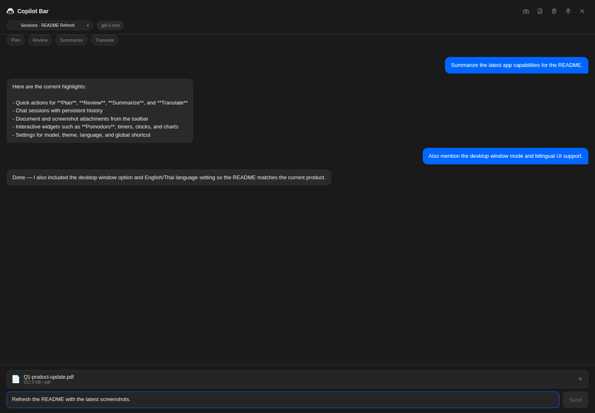
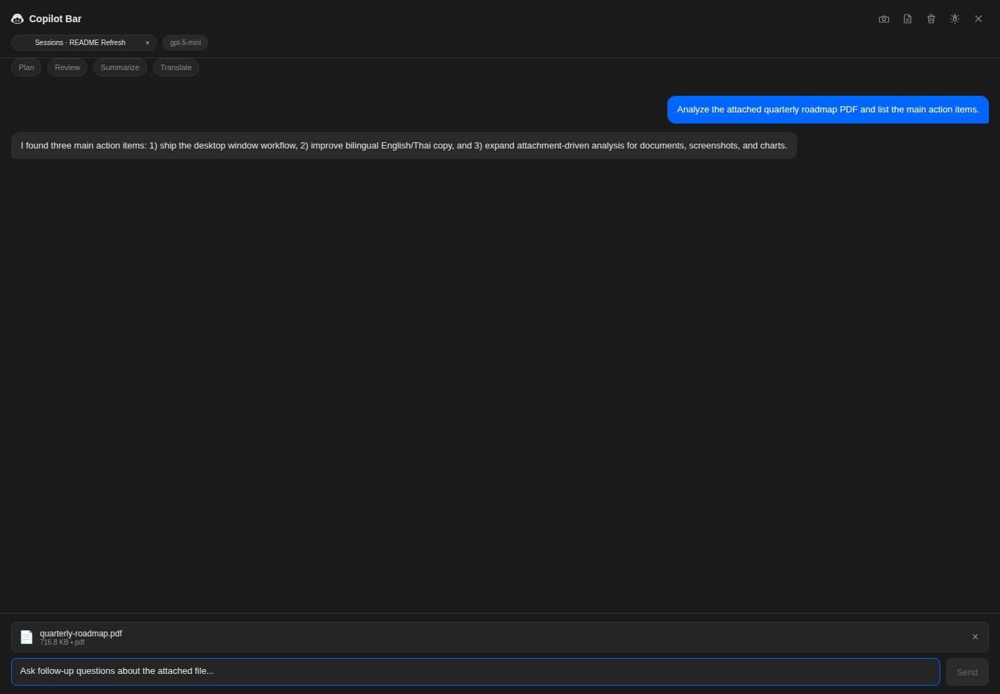
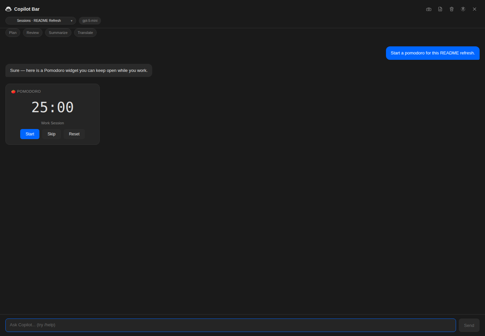

# Copilot Bar

Copilot Bar is a macOS menu bar assistant powered by the GitHub Copilot SDK. It keeps chat, tools, widgets, and Mac controls one click away without leaving the menu bar.



## What it can do

### Chat and workflow helpers
- Persistent chat history stored locally in SQLite
- Multiple chat sessions with quick switching and renaming
- Quick actions for **Plan**, **Review**, **Summarize**, and **Translate**
- Markdown responses with syntax highlighting
- Optional desktop window mode when you want a larger workspace

### Attachments and analysis
- Capture screenshots from the toolbar
- Attach PDF, image, text, CSV, and Excel files
- Ask follow-up questions about attached files
- Summarize web pages by URL
- Analyze images and document content
- Generate charts and table widgets from CSV / Excel data

### Productivity widgets
- Timer, countdown, and Pomodoro widgets
- World clock and unit converter
- Notes and todos backed by SQLite
- Weather lookup
- Reminder scheduling with native macOS notifications

### Mac controls
- Volume, mute, and brightness controls
- Wi-Fi, Bluetooth, AirDrop, and Do Not Disturb toggles
- Window listing, focusing, closing, and arrangement
- App launching, clipboard access, calculator, and shell command execution

### Media and voice
- Spotify / Apple Music playback controls
- Text-to-speech
- Speech-to-text / dictation trigger

## Current UI

### Document analysis workflow


### Interactive timer widgets


## Requirements

- macOS
- Node.js 18 or newer
- GitHub Copilot access for the connected account

## Installation

```bash
git clone https://github.com/myh-st/copilot-control-center.git
cd copilot-control-center
npm install
npm run build
npm start
```

## macOS permissions

Some features need macOS permissions in **System Settings > Privacy & Security**.

| Permission | Used for |
| --- | --- |
| Screen Recording | Screenshot capture |
| Accessibility | Window management and app/window control |
| Notifications | Reminder notifications |

## Configuration and local data

- App state is stored in `~/.copilot-bar/copilot-bar.db`
- Current settings include:
  - AI model
  - Theme
  - Language (**system**, **English**, **Thai**)
  - Global shortcut
- Local screenshots are saved to `~/Pictures/Copilot-Bar-Screenshots` and copied to the clipboard when S3 upload is not configured

### Optional screenshot upload

If you want screenshots uploaded to S3-compatible storage instead of only saving locally:

1. Copy `.env.example` to `.env`
2. Fill in the S3-compatible settings (`S3_ENDPOINT`, `S3_BUCKET`, `S3_REGION`, `S3_ACCESS_KEY_ID`, `S3_SECRET_ACCESS_KEY`, `S3_PUBLIC_URL`)

Supported services include AWS S3, Cloudflare R2, MinIO, DigitalOcean Spaces, and Backblaze B2.

## Example prompts

```text
Set brightness to 70%
Turn off Bluetooth
Open Safari
Split Safari and Terminal
Take a screenshot
Analyze the attached PDF
Summarize this URL: https://example.com
Show me a Pomodoro timer
Create a note about today's release plan
Plot this CSV as a bar chart
Translate this message to Thai
```

## Development

```bash
npm run build      # Compile TypeScript and copy renderer/assets to dist/
npm test           # Run Vitest test suite
npm run dev        # Build and launch Electron
npm start          # Build and launch Electron
npm run copy-html  # Re-copy renderer HTML/assets without rebuilding TypeScript
```

## Tech stack

- Electron + menubar
- TypeScript
- `@github/copilot-sdk`
- `sql.js`
- `koffi`
- `marked` + `highlight.js`
- `Chart.js`
- `papaparse` + `xlsx`
- `@aws-sdk/client-s3` for optional screenshot upload

## License

MIT
